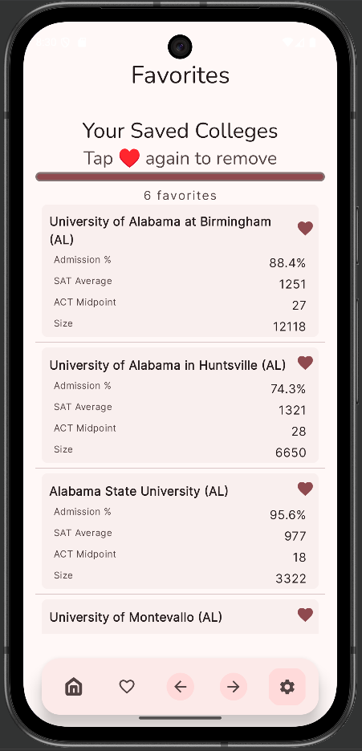
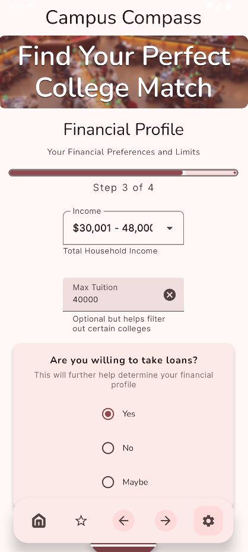
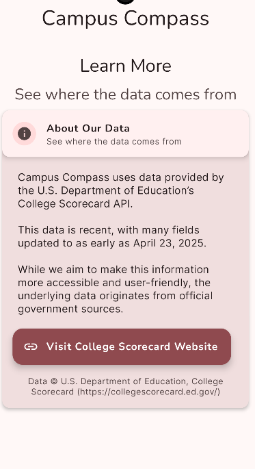
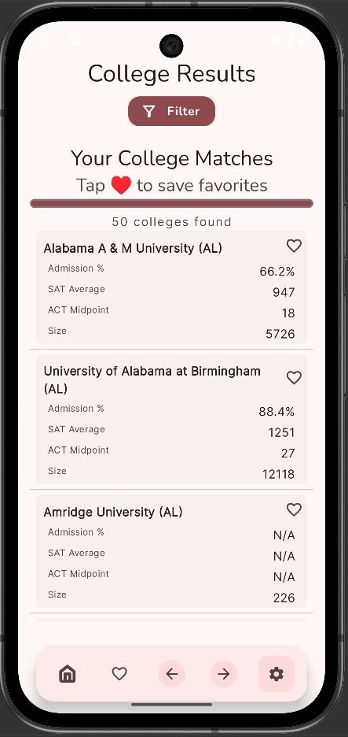

# Campus Compass Demo 🚀

This repository is a **college exploration app** demo showcasing a few UI screens and components built with **Jetpack Compose** and **Material 3**. The full app includes backend logic and live API integration.

---

## Features
- Home screen layout  
- College item cards  
- Settings screen layout  
- Responsive UI built with Jetpack Compose and Material 3  
- Sample data for demonstration purposes  

---

## Tech Stack
- **Languages:** Kotlin  
- **UI Framework:** Jetpack Compose, Material 3  
- **Android SDK:** minSdk 24, targetSdk 35, compileSdk 36  
- **State Management:** AndroidX ViewModel, LiveData  
- **Navigation:** Jetpack Compose Navigation  
- **Images & Fonts:** Coil Compose, Google Fonts
- **Networking (Serialization):** Ktor  
- **Coroutines:** KotlinX Coroutines  
- **Testing:** JUnit, AndroidX Test, Espresso  

---

## Plugins
- Android Application plugin  
- Kotlin Android plugin  
- Kotlin Symbol Processing (KSP)  
- Kotlin Serialization plugin  
- Jetpack Compose plugin  

---

## College Scorecard API
Campus Compass uses the [**U.S. Department of Education College Scorecard API**](https://collegescorecard.ed.gov/) to provide accurate college data:

- Admission rates  
- Program offerings and relative student percentages  
- Demographic breakdowns (gender, race, etc.)  
- Other key statistics for comparison  

> **Note:** The API key is not included in this public demo. The full app fetches live data dynamically, but this demo only includes static UI screens and sample data.

---

## 📸 Screenshots / Demo

---

## Note
This repository contains a **subset of UI components** and demo screens. The full application contains additional features, backend logic, and API integrations that are **not publicly available**.

